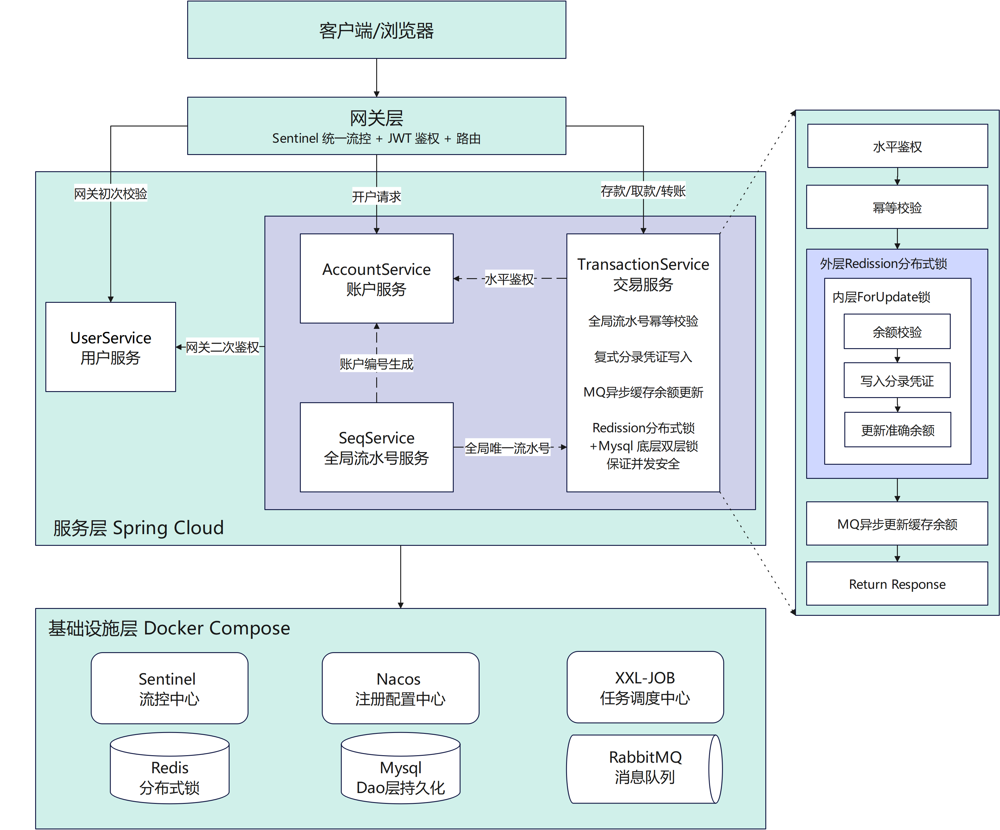

# Spring Boot Microservices Banking Application

> 基于原项目 [kartik1502/Spring-Boot-Microservices-Banking-Application](https://github.com/kartik1502/Spring-Boot-Microservices-Banking-Application) 进行改造，在原有微服务架构基础上引入**金融级复式记账、双层并发锁、接口幂等、日终对账**等特性。

---

## 系统架构



---

## 与原始项目的主要变化

| 原项目 | 改造后 |
|--------|--------|
| 余额直接加减 `balance = balance ± amount` | **复式记账**：凭证 + 借贷分录，每笔记账都有借方和贷方 |
| 无并发保护 | **双层锁**：外层 Redisson 分布式锁 + 内层 InnoDB FOR UPDATE 行锁 |
| UUID 幂等键 | **Sequence-Generator** 号段模式生成趋势递增流水号 + UK 约束幂等 |
| 单一余额字段 | **双余额**：`account_balance` 权威余额（同库原子）+ `availableBalance` 展示缓存（MQ 异步） |
| 同步 Feign 调 Account-Service | **本地事务 + MQ 异步**：分录 + 余额同库原子提交，缓存 MQ 异步刷新 |
| 无对账机制 | **XXL-JOB** 日终对账 + 全局试算平衡 + 审计日志 |
| Keycloak 鉴权 | Spring Security JWT + 网关 + 下游服务双重鉴权 + 水平鉴权 |
| 无幂等保护 | 全局流水号 + UNIQUE 约束，网络重试不重复记账 |
| 单机启动 | **Docker Compose** 一键部署全部中间件 + 服务 |

---

## 项目特点

### 金融级复式记账

每笔业务 = 一张凭证 + N 条借贷分录。分录只 INSERT 不改不删，借贷必等，审计可追溯。

```
存款:  客户账户 CREDIT 1000  +  现金科目 DEBIT 1000
取款:  客户账户 DEBIT  500   +  现金科目 CREDIT 500
转账:  ACC001   DEBIT  500   +  ACC002    CREDIT 500
```

### 双层并发锁

```
外层 Redis 锁 (Redisson)  →  排队等待，减少 DB 竞争
内层 InnoDB 行锁 (FOR UPDATE)  →  绝对串行，永不失效
```

转账多账户排序防死锁，取款单锁保护。

### 接口幂等

Sequence-Generator 号段模式生成全局流水号（`TX2026062600000001`），存入 `reference_id` 字段并加 UNIQUE 约束。同一幂等键第二次到达直接返回已有结果。

### 双余额字段

| | account_balance（权威） | availableBalance（缓存） |
|------|----------------------|------------------------|
| 位置 | Transaction-Service 库 | Account-Service 库 |
| 更新 | 与分录同库原子提交 | MQ 异步刷新 |
| 用途 | 交易鉴权 | 用户查余额 |

### 分布式事务（本地消息表模式）

分录写入与余额同步解耦：分录落库即成功，余额缓存通过 RabbitMQ 异步更新。MQ 消费者失败自动重试，最终一致。

### XXL-JOB 日终对账

- **全量对账**（每日凌晨）：逐账户比对分录余额与缓存余额，不一致自动修正
- **全局试算平衡**：SUM(全部借方) == SUM(全部贷方)，不等则告警
- **审计日志**：每次修正记录 `reconciliation_log`

---

## 技术栈

| 类别 | 技术 |
|------|------|
| 框架 | Spring Boot 2.7 + Spring Cloud 2021.0.8 |
| 语言 | Java 17 |
| 数据库 | MySQL 8.0 |
| 缓存 & 锁 | Redis 7 + Redisson 3.23 |
| 消息队列 | RabbitMQ 3.13 |
| 任务调度 | XXL-JOB 2.4 |
| 注册 & 配置 | Nacos 2.2 |
| 容器化 | Docker + Docker Compose |

---

## 微服务

| 服务 | 端口 | 职责 |
|------|------|------|
| API-Gateway | 8080 | JWT 鉴权 + 路由转发 |
| User-Service | 8082 | 用户注册/登录 |
| Account-Service | 8081 | 账户管理 + 余额展示缓存 |
| Transaction-Service | 8084 | **复式记账核心** |
| Fund-Transfer | 8085 | 转账（已合并入 TX） |
| Sequence-Generator | 8083 | 全局流水号 + 账户编号生成 |

---

## 快速启动

### Docker 部署（推荐）

```bash
# 1. 编译各服务 JAR（在 IDEA 中 mvn package）

# 2. 一键构建镜像 + 启动
docker compose up -d --build

# 3. 停止
docker compose down

# 4. 重启（不改代码，秒级）
docker compose up -d
```

### 本地脚本启动

```bash
# 1. 启动中间件
cd D:\bank-env && docker-compose up -d

# 2. 启动微服务
start-services.bat
```

### 访问地址

| 组件 | 地址 |
|------|------|
| API | http://localhost:8080 |
| Swagger (TX) | http://localhost:8084/swagger-ui.html |
| Swagger (Account) | http://localhost:8081/swagger-ui.html |
| Nacos | http://localhost:8848/nacos |
| XXL-JOB | http://localhost:8092/xxl-job-admin (admin/123456) |
| RabbitMQ | http://localhost:15672 (bank/bank123) |

---

## 文档

- [接口测试文档](./接口测试文档.md)
- [项目亮点总结](./项目亮点总结.md)
- [原项目地址](https://github.com/kartik1502/Spring-Boot-Microservices-Banking-Application)
